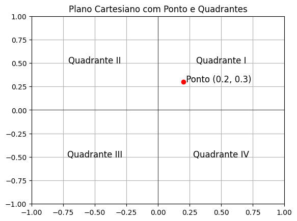

# Operadores e Estruturas de Controle em Python 

## Operadores

Os operadores são símbolos que representam operações matemáticas ou lógicas. Os operadores aritméticos são utilizados para realizar operações matemáticas. Os operadores de comparação são utilizados para comparar valores. Os operadores lógicos são utilizados para combinar valores booleanos.

### Operadores Aritméticos

Os operadores aritméticos são utilizados para realizar operações matemáticas. Os operadores aritméticos são os seguintes:

- `+` (adição)
- `-` (subtração)
- `*` (multiplicação)
- `/` (divisão)
- `//` (divisão inteira)
- `%` (resto da divisão)
- `**` (exponenciação)
- `()` (parênteses)

Abaixo temos um exemplo de uso dos operadores aritméticos:

```python
a = 10
b = 3
soma = a + b
subtracao = a - b
multiplicacao = a * b
divisao = a / b
divisao_inteira = a // b
resto_divisao = a % b
exponenciacao = a ** b
```


### Operadores de Comparação

Os operadores de comparação são utilizados para comparar valores. Os operadores de comparação são os seguintes:

- `==` (igual a)
- `!=` (diferente de)
- `>` (maior que)
- `<` (menor que)
- `>=` (maior ou igual a)
- `<=` (menor ou igual a)

Abaixo temos um exemplo de uso dos operadores de comparação:

```python
a = 10
b = 3
igual = a == b
diferente = a != b
maior = a > b
menor = a < b
maior_igual = a >= b
menor_igual = a <= b
```

### Operadores Lógicos

Os operadores lógicos são utilizados para combinar valores booleanos. Os operadores lógicos são os seguintes:

- `and` (e)
- `or` (ou)
- `not` (não)
- `()` (parênteses)

Esses operadores consideram que `True` é equivalente a 1 e `False` é equivalente a 0. Abaixo mostramos as tabelas verdade para os operadores lógicos `not`, `and` e `or`:

### Tabela Verdade do Operador `not`

| a     | not a |
|-------|-------|
| True  | False |
| False | True  |

### Tabela Verdade do Operador `and`

| a     | b     | a and b |
|-------|-------|---------|
| True  | True  | True    |
| True  | False | False   |
| False | True  | False   |
| False | False | False   |

### Tabela Verdade do Operador `or`

| a     | b     | a or b  |
|-------|-------|---------|
| True  | True  | True    |
| True  | False | True    |
| False | True  | True    |
| False | False | False   |

O uso de operadores lógicos é ilustrado no exemplo a seguir:

```python
a = True
b = False

not_a = not a
and_ab = a and b
or_ab = a or b

print(not_a)
print(and_ab)
print(or_ab)
```

## Estruturas de Controle Condicionais

As estruturas de controle são utilizadas para controlar o fluxo de execução de um programa. As estruturas de controle em Python são as seguintes:

- `if` (se)
- `elif` (senão se)
- `else` (senão)

A estrutura de controle condicional `if` é utilizada para executar um bloco de código se uma condição for verdadeira. A estrutura de controle condicional `elif` é utilizada para executar um bloco de código se a condição do `if` for falsa e a condição do `elif` for verdadeira. A estrutura de controle condicional `else` é utilizada para executar um bloco de código se todas as condições anteriores forem falsas.

Abaixo temos um exemplo de uso das estruturas de controle condicionais:

```python
a = 10
b = 3

if a > b:
    print('a é maior que b')
elif a < b:
    print('a é menor que b')
else:
    print('a é igual a b')
```

Para verificar se um número é par ou ímpar, podemos utilizar o operador `%` para calcular o resto da divisão por 2. Se o resto da divisão for igual a zero, o número é par. Caso contrário, o número é ímpar. Abaixo temos um exemplo de uso das estruturas de controle condicionais para verificar se um número é par ou ímpar:

```python
numero = 10

if numero % 2 == 0:
    print('O número é par')
else:
    print('O número é ímpar')
```

Imagine se for necessário saber se um determinado aluno passou ou ficou de prova final. Para isso, é necessário verificar se a média do aluno é maior ou igual a 7.0. Se a média for maior ou igual a 7.0, o aluno passou. Caso contrário, o aluno ficou de prova final. Abaixo temos um exemplo de uso das estruturas de controle condicionais para verificar se um aluno passou ou ficou de prova final:

```python
media = 6.0

if media >= 7.0:
    print('O aluno passou')
else:
    print('O aluno ficou de prova final')
```

Se for necessário se uma nota é válida antes do cálculo da média e da verificação se o aluno está aprovado, podemos utilizar a estrutura de controle condicional `if` para verificar se a nota é maior ou igual a zero e menor ou igual a dez. Abaixo temos um exemplo de uso das estruturas de controle condicionais para verificar se uma nota é válida, calcular a média e verificar se o aluno está aprovado:

```python
nota1 = float(input('Digite a primeira nota: '))
nota2 = float(input('Digite a segunda nota: '))

if 0 <= nota1 <= 10 and 0 <= nota2 <= 10:
    media = (nota1 + nota2) / 2
    if media >= 7.0:
        print('O aluno passou')
    else:
        print('O aluno ficou de prova final')
```

Para verificar em qual quadrante um ponto está no plano cartesiano, podemos utilizar a estrutura de controle condicional `if` para verificar se as coordenadas do ponto são positivas ou negativas. O quadrante do ponto é determinado da seguinte forma: 

- 1º quadrante: x > 0 e y > 0
- 2º quadrante: x < 0 e y > 0
- 3º quadrante: x < 0 e y < 0
- 4º quadrante: x > 0 e y < 0

A imagem a seguir ilustra os quadrantes do plano cartesiano:



Abaixo temos um exemplo de uso das estruturas de controle condicionais para verificar em qual quadrante um ponto está no plano cartesiano:

```python
x = float(input('Digite a coordenada x: '))
y = float(input('Digite a coordenada y: '))

if x > 0 and y > 0:
    print('O ponto está no 1º quadrante')
elif x < 0 and y > 0:
    print('O ponto está no 2º quadrante')
elif x < 0 and y < 0:
    print('O ponto está no 3º quadrante')
elif x > 0 and y < 0:
    print('O ponto está no 4º quadrante')
else:
    print('O ponto está na origem')
```

O uso de operadores lógicos e estruturas de controle condicionais é ilustrado no exemplo a seguir:

```python

a = 10
b = 3

if a > b and a % 2 == 0:
    print('a é maior que b e a é par')
elif a < b or a % 2 != 0:
    print('a é menor que b ou a é ímpar')
else:
    print('a é igual a b')
``` 

É importante dominar os conceitos de tabelas verdade e de estruturas de controle condicionais para resolver problemas de programação. Os operadores e estruturas de controle em Python são fundamentais para o desenvolvimento de programas de computador. 